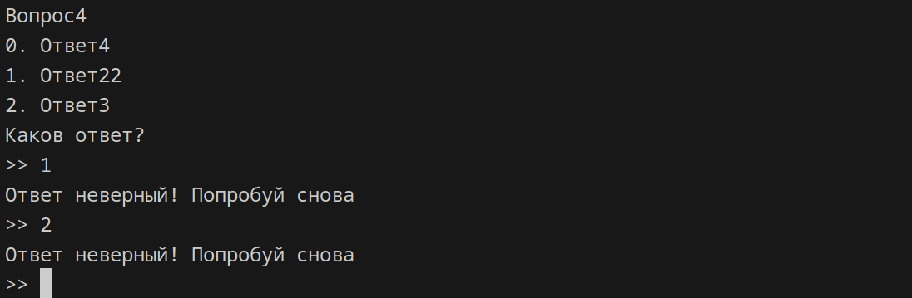

# Описание

  

Пару скриптов для создания тестов с вопросами и ответами

# Использование

В файле `data.json` хранятся вопросы и ответы (ответов может быть несколько). С помощью модуля `questions` можно создавать целые опросники всего в несколько десятков строк кода в `main.py`

> Пример этого приведен в `example.py`

## Модуль `questions`

### `questions/data.py`

\- отвечает за хранение данных о всех вопросах

> Далее методы класса `Data`

#### метод `load_json`

позволяет загрузить данные из json файла

#### метод `add_data`

позволяет добавлять вопросы (поддерживается только по отному вопросу и ответу за раз)

#### метод `get_rand_question`

позволяет получить случайный вопрос из файла json

### `questions/question.py`

\- отвечает за отдельно взятый вопрос

> Далее методы класса `Question`

#### метод `load`

позволяет загрузить данные для отдельно взятого вопроса

#### метод `get_title`

позволяет получить заголовок вопроса

#### метод `get_answers`

позволяет получить список всех ответов к вопросу (правильных и неправильных)

#### метод `is_right`

позволяет проверить правильность выбранного ответа

# пример `main.py`:

  

