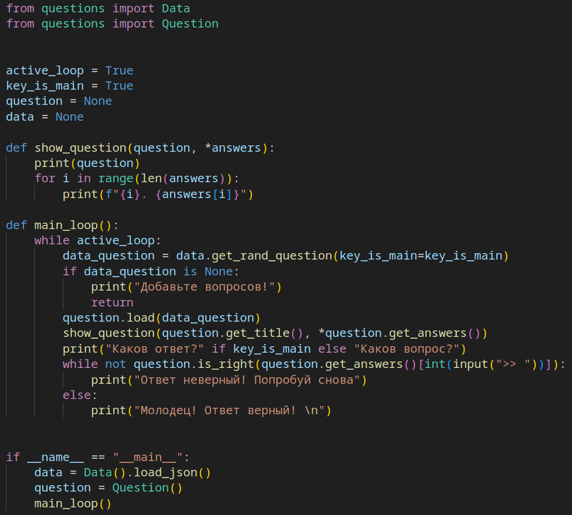

# Описание

  

Пару скриптов для создания тестов с вопросами и ответами

# Использование

В файле `data.json` хранятся вопросы и ответы (ответов может быть несколько). С помощью файлов `data.py` и `question.py` можно создавать целые опросники всего в несколько десятков строк кода в `main.py`

