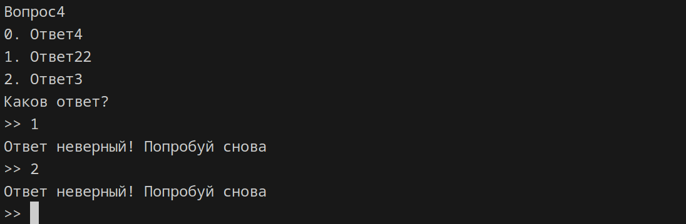
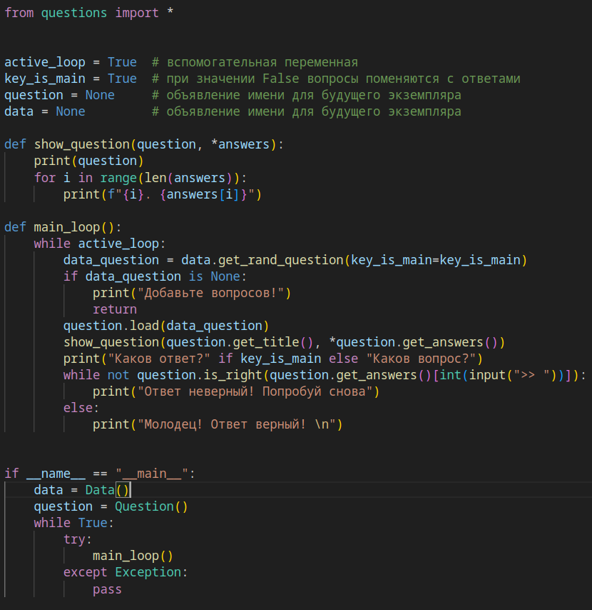

# Описание

<div align="center">
  
</div>


Пару скриптов для создания тестов с вопросами и ответами

# Использование

В файле `data.json` хранятся вопросы и ответы, расформированные по группам (ответов может быть несколько). С помощью модуля `questions` можно создавать целые опросники всего в несколько десятков строк кода в `main.py`

> Пример этого приведен в `/examples`

## Модуль `questions`

### —> <u>`questions/data.py`</u>

\- отвечает за хранение данных о всех вопросах

```python
# Инициализация:
data = QuestionsData(path_to_json="my_json.json")
```

загрузка данных из файла `my_json.json`. Если `path_to_json` не указан, то работа с json файлом произоводится не будет

> далее методы класса `QuestionsData`

#### — метод `load_json`

позволяет загрузить новые данные из словаря

```python
data = QuestionsData()

data_dict = {"Набор4": {"Вопрос1": "Ответ1", "Вопрос2": "Ответ2"}}
data.load_json(data_dict)
```

#### — метод `add_data`

позволяет добавлять вопросы (поддерживается только по отному вопросу и ответу за раз)

```python
data = QuestionsData()
data.add_data(
  group="Набор4",
  key="Вопрос1",
  value="Ответ1"
)
```

#### — метод `get_groups`

позволяет получить список всех групп

```python
data = QuestionsData()
groups = data.get_groups()
```

#### — метод `get_items`

позволяет получить элементы группы

```python
data = QuestionsData()
items = data.get_items(group="Набор1")
```

получим элементы группы `Набор1`

#### — метод `get_all_data`

позволяет получить все данные

```python
data = QuestionsData()
all_data = data.get_all_data()
```


#### — метод `get_question`

позволяет получить вопрос из файла json

```python
data = QuestionsData()
data_question = data.get_guestion(
  group="Набор1",
  title="Вопрос1",
  quentity_items=5
)
```

получим данные вопроса `Вопрос1` из группы `Набор1` с количеством вариантов ответа равным пяти

#### — метод `get_rand_question`

позволяет получить случайный вопрос из файла json

```python
data = QuestionsData()
data_question = data.get_rand_question(
  group="Набор1",
  quentity_items=5
)
```

получим данные случайного вопроса из группы `"Набор1"` с количеством вариантов ответа равным пяти (если `group` не задан, вопрос будет выбран из случайной группы)

### —> <u>`questions/question.py`</u>

\- отвечает за отдельно взятый вопрос

```python
# Инициализация:
question = Question()
```

> далее методы класса `Question`

#### — метод `load`

позволяет загрузить данные для отдельно взятого вопроса

```python
data = QuestionsData()
data_question = data.get_rand_question()

question = Question()
question.load(data_question)
```

получение и загрузка данных случайного вопроса

#### — метод `get_title`

позволяет получить заголовок вопроса

```python
question = Question()
...
title = question.get_title()
```

#### — метод `get_group`

позволяет получить наименование группы вопроса

```python
question = Question()
...
group = question.get_group()
```

#### — метод `get_answers`

позволяет получить список всех ответов к вопросу (правильных и неправильных)

```python
question = Question()
...
answers = question.get_answers()
```

#### — метод `is_right`

позволяет проверить правильность выбранного ответа

```python
question = Question()
...
answer = ...
right = question.is_right(answer)
```

# пример `main.py`:

<div align="center">
  
</div>

остальные примеры в `/examples`